# 🚀 DatumSync

DatumSync is an intelligent, automated data pipeline platform designed to streamline large-scale data processing with modular support for **Validation**, **Normalization**, **Conversion**, **Prediction**, and **Profiling**. Built with a FastAPI backend, Google Cloud services, and a sleek dashboard UI, DatumSync is your all-in-one solution for seamless data operations.

## 🧠 Why DatumSync?

> “A modern enterprise needs more than just pipelines — it needs *intelligence at every step*.”

### ✨ Key Features

* ✅ **Data Validation** — Ensures schema and data integrity between source and target files.
* 🌀 **Normalization** — Cleans and standardizes raw data into high-quality formats.
* 🔀 **Conversion** — Converts CSV to Parquet format with cloud-based triggers.
* 🧠 **Prediction** — Applies machine learning classification to predict outcomes on uploaded data.
* 🔍 **Profiling** — Auto-generates data reports with summary statistics.
* 📈 **Interactive Dashboard** — Real-time stats and history of data operations.
* 💳 **Stripe-powered Subscription** — Upgrade to Pro for unlimited access and premium features.

---

## 🛠 Tech Stack

| Category        | Technologies                                                               |
| --------------- | -------------------------------------------------------------------------- |
| Backend         | **FastAPI**, **SQLAlchemy**, **Authlib (OAuth)**                           |
| Frontend        | **Jinja2 Templates**, **Tailwind CSS**, **Chart.js**                       |
| Cloud & Storage | **Google Cloud Run**, **Google Cloud Storage**, **Pub/Sub**, **Terraform** |
| ML / Data       | **Pandas**, **Scikit-learn**                                               |
| Database        | **Supabase PostgreSQL**                                                    |
| Payment         | **Stripe** (Webhooks + Checkout)                                           |
| Auth            | **Google OAuth 2.0**                                                       |

---

## ⚙️ How It Works

```mermaid
graph TD

    A[👤 User Uploads File] --> B["📁 GCS Central Bucket (Raw Uploads)"]
    B --> C["📨 Pub/Sub Trigger"]
    C --> D["⚡ Eventarc (Object Finalized)"]

    D --> E1["🚀 Cloud Run: Conversion"]
    D --> E2["🚀 Cloud Run: Normalization"]
    D --> E3["🚀 Cloud Run: Validation"]
    D --> E4["🚀 Cloud Run: Prediction"]
    D --> E5["🚀 Cloud Run: Profiling"]

    subgraph "🧠 Cloud Run Microservices"
        E1 --> F1["✅ Convert to Parquet"]
        E2 --> F2["✅ Normalize Columns"]
        E3 --> F3["✅ Validate Source-Target"]
        E4 --> F4["✅ Run ML Predictions"]
        E5 --> F5["✅ Generate Data Profile"]
    end

    F1 --> G1["📦 GCS User Bucket (Processed Output)"]
    F2 --> G2
    F3 --> G3
    F4 --> G4
    F5 --> G5

    F1 --> DB["🗃️ Supabase PostgreSQL (Reports Table)"]
    F2 --> DB
    F3 --> DB
    F4 --> DB
    F5 --> DB

    DB --> H["📊 FastAPI Dashboard & Reports"]
    H --> I["🔐 Google OAuth (Authlib)"]


```



---


```mermaid
graph TD;
    Upload[📤 User Uploads File via UI] --> SaveToDB[(🗃️ Save File Info to PostgreSQL)]
    Upload --> CentralGCS[(☁️ Store in Central GCS Bucket)]

    SaveToDB --> Router{📌 Based on Selected Module}
    Router --> Convert[🔁 Conversion Module]
    Router --> Normalize[🧪 Normalization Module]
    Router --> Validate[✅ Validation Module]
    Router --> Predict[🔮 Prediction Module]
    Router --> Profile[📊 Profiling Module]

    Convert --> UserGCS[(👤 Store in User GCS Bucket)]
    Normalize --> UserGCS
    Validate --> UserGCS
    Predict --> UserGCS
    Profile --> UserGCS

    UserGCS --> UpdateDB[(🗂️ Update Output Path in PostgreSQL)]
    UpdateDB --> Dashboard[User Dashboard & Reports]

```

## 🧪 Live Demo

> 🌐 **Live URL:** [https://datumsync.onrender.com](https://datumsync.onrender.com)

Use Google OAuth to log in and explore all modules. For demo Stripe payments, use:

```
Card: 4242 4242 4242 4242
Exp: Any future date
CVC: Any 3 digits
```

---

## 🧹 Modules & Routes

| Module        | Endpoint                                      | Description                       |
| ------------- | --------------------------------------------- | --------------------------------- |
| Auth          | `/login`, `/auth/callback`                    | Google OAuth 2.0 Login            |
| Validation    | `/validate`, `/columns`                       | File-based schema and data check  |
| Normalization | `/normalize`, `/normalize-file`               | Standardizes data formats         |
| Conversion    | `/convert`                                    | CSV to Parquet conversion         |
| Prediction    | `/predict`                                    | ML predictions on normalized data |
| Profiling     | `/profile`                                    | Data profiling reports            |
| Dashboard     | `/dashboard`                                  | Interactive stats and graphs      |
| Subscription  | `/subscription`, `/subscribe/pro`, `/success` | Stripe Pro Plan                   |

---

## 📦 Setup Instructions

```bash
# 1. Clone the repo
git clone https://github.com/yourusername/datum-sync.git
cd datum-sync

# 2. Create a virtual environment & install dependencies
python -m venv venv
source venv/bin/activate
pip install -r requirements.txt

# 3. Set up .env for secrets
cp .env.example .env  # Add your GCP, Supabase, and Stripe keys

# 4. Run locally
uvicorn main:app --reload
```

---

## ☁️ Deployment

This project is deployed via:

* 🔧 **Render (App Hosting)**
* ☁️ **Google Cloud Run (Modular services)**
* 📎 **Stripe (Billing)**
* 📃 **Supabase (PostgreSQL DB & auth)**

---

## ✅ What's Unique?

* **GCP-native triggers:** Event-driven architecture using Pub/Sub and Cloud Run.
* **Stripe Checkout + Webhooks:** Full billing cycle implemented.
* **Modular cloud pipeline:** Each stage (e.g., validation, prediction) is its own microservice.
* **Real-time dashboard with visual analytics.**

---

## 📌 Google-readiness Highlights

* Full-stack GCP + Python + FastAPI implementation
* Clean modular microservice architecture
* Secure OAuth authentication + database integration
* Production-grade billing system with Stripe
* Optimized for large datasets (500k+ records)
* Dockerized for scalable deployment

---

## 👨‍💻 Author

**Shubham Singh**
MSc Data Science, University of Nottingham
📧 [shubhamsinghvr2n@gmail.com](mailto:shubhamsinghvr2n@gmail.com)
🔗 [LinkedIn](https://www.linkedin.com/in/shubhamvr2n) | [GitHub](https://github.com/yourusername)

---

## 🏁 License

MIT License — free to use with attribution.
